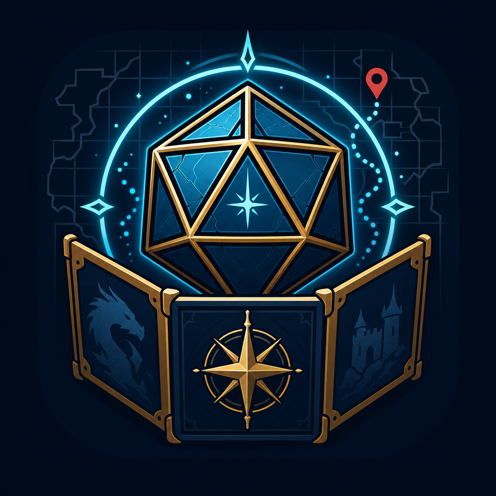
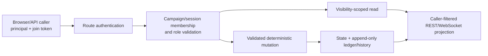

# Headless Multi-Agent AI-Driven VTT Engine

<p align="center">
  
</p>

Production-oriented VTT + RPG engine with deterministic state, append-only event ledger, strict visibility filtering, and multi-agent LLM layer (DM, NPCs, Gods, Factions) that can only propose schema-validated actions.

**Two ways to use TableTop DM:**
- **Web GUI**: Full-featured browser interface for gameplay, campaign management, and character creation
- **Headless API**: REST + WebSocket API for programmatic access, custom frontends, or integration with other tools

See [Using the Web Interface](#using-the-web-interface-gui) for GUI quickstart or [API Endpoints](#api-endpoints) for headless access.

**See [CHANGELOG.md](CHANGELOG.md)** for a date-ordered history of feature drops plus the current 1.0 release track. The Implementation Status table below is a quick reference; the changelog is where I write down *what* and *why* per release window.


## Implementation Status
**Release phases are tracked and regularly audited.** See `docs/release/1.0-rc-checklist.md` for the release checklist and `docs/release/1.0-scope.md` for the 1.0 scope cutline.

| Phase | Description | Status |
|-------|-------------|--------|
| 0 | Repo structure + contracts/specs | Done |
| 1 | Infrastructure (PostgreSQL via Docker Compose or Replit) | Done |
| 2 | Data model + schemas (state, ledger, security) | Done |
| 3 | Event envelope + intervention contracts | Done |
| 4 | Migrations + seed data (Eclipse Keep demo) | Done |
| 5 | Mechanics engine + spatial engine | Done |
| 6 | Orchestrator/router + validation pipeline | Done |
| 7 | Visibility enforcement (RLS) | Done |
| 8 | LLM adapter (DM narration + NPC dialogue) | Done |
| 9 | Conversation pipelines (Olympus, proximity, off-screen) | Done |
| 10 | Karma router + divine standings | Done |
| 11 | Divine system (AP, authority, grudges) | Done |
| 12 | NPC persistence + consequence engine | Done |
| 13 | Social system + ambush pipeline | Done |
| 14 | Guilds/factions/patrons | Done |
| 15 | Economy + property | Done |
| 16 | Content rating gate | Done |
| 17 | Maps (upload + procedural generation) | Done |
| 18 | Frontend MVP (event feed, console, map viewer) | Done |
| 19 | Export + replay + debugging | Done |
| 20 | Observability + CI/testing (59 unit tests) | Done |
| 21 | Auto-generate maps on session create (idempotent, deterministic seed) | Done |
| 22 | **Three.js map renderer** — ortho camera, NearestFilter, raycaster, WASD movement, OrbitControls pan/zoom | Done |
| 23 | **Hierarchical map system** — World → Area → Room tiers with parent_map_id, breadcrumbs, zoom transitions | Done |
| 24 | **Themed scene generators + decorations** — biome-aware composers, FF-Tactics palette, billboard sprites for trees/barrels/chests/etc. | Done |
| 25 | **POI proximity discovery** — class-modulated perception radius (ranger 5, fighter 2), Chebyshev distance, clickable drilldown markers | Done |
| 26 | **Party decoherence foundation** - `entities.current_map_id`, audience_for_event(), transition_entity_map() | Done |
| 27 | **Combat HUD** — JRPG-style Fight/Item/Spell/Move/End Turn/Flee menu | Done |
| 28 | **Multi-provider AI scaffolding** — OpenRouter, DeepSeek, Anthropic alongside OpenAI/Ollama/LM Studio | Done |
| 29 | **OpenRouter image generation** — server-tool flow with cheap host model + image model, supports Gemini/Flux/Seedream/etc. | Done |
| 30 | **API key vault** — Fernet encryption at rest with installation-local vault key, redacted GET responses, dedicated UI panel | Done |
| 31 | **External save files** — passphrase-encrypted `.ttdm` files for game state and program config, portable across machines | Done |
| 32 | **Desktop launcher** — one-click `.lnk` that boots compose + Flask + opens the dashboard | Done |
| 33 | **Session-intelligence extractor** — deterministic-from-ledger + LLM-driven structured-output paths into a review queue | Done |
| 34 | **Proposed-patch review queue** (`state.proposed_story_patches`) with PENDING / APPROVED / REJECTED / EDITED / APPLIED workflow | Done |
| 35 | **Pydantic extraction contracts** (`Evidence`, `ExtractedStoryEvent`, `StoryEventType` enum) | Done |
| 36 | **Story-state auto-patcher** — per-event-type dispatch into `state.story_state` fields | Done |
| 37 | **Visibility-scoped recaps** — DM / party / principal / public; falls back to deterministic bullets if no LLM | Done |
| 38 | **Continuity queries** — open threads, unresolved promises, NPC memory, contradictions | Done |
| 39 | **RAG-grounded DM/NPC cognition** — centralized retriever, visibility-filtered prompt injection, embedding-profile guard, north-star leak-prevention tests | Done |
| 40 | **RAG-aware Session Intel + packet citations** - extractor lore context, `rag_chunk` evidence, review enforcement, recap/packet sources | Done |
| 41 | **Per-principal realtime broadcaster** - scoped Socket.IO rooms, DM-only routing, visible_to precedence, spatial audience delivery | Done |
| 42 | **Verification harness + integration repair** - Python integration boot, socket visibility tests, cross-surface visibility matrix | Done |
| 42.5 | **E2E landing tour contract repair** - deterministic `?tour=1` hook, Playwright preflight, app-owned console capture, route smokes | Done |
| 42.6 | **App readiness triage** - structured `/readyz`, bounded DB readiness, dashboard route regression, strict CI E2E preflight | Done |
| 42.7 | **Continuity API visibility hardening** - member-required NPC memory/promises, principal-scoped filtering, payload visibility contract lock | Done |
| 42.8 | **Full Player State Snapshot** - principal-scoped runtime bundle for identity, controls, visible world, narrative state, legal actions, and event cursor | Done |
| 42.9 | **1.0 Release Gate and Scope Freeze** - release scope, test matrix, security matrix, and RC checklist | Done |
| 43 | **1.0 Boot, Recovery, and Verification Hardening** - Windows boot path, save/load roundtrip tests, cursor-gap recovery, route/auth matrix, V1 golden-path smoke | Done |
| 44 | **1.0 Route Auth, Visibility, and Runtime QA Closure** - route-layer auth parity, DIALOGUE history, traceback suppression, launcher stderr handling | Done |
| 45 | **Gemini Review Closure** - blueprint registration, API helper extraction, registry state-delta dispatcher, DB-owned cascade cleanup, local embedding defaults, Session Intel retry, JS module entrypoints | Done |
| 46 | **Doc Cleanup** - Gemini closure authorship, blueprint-scope caveat, stale checklist pointer cleanup | Done |
| 47 | **Local Identity & Join UX** - revocable join codes, strict join-token enforcement hooks, Control Plane join-code surface | Done |
| 48 | **Snapshot / Delta / Reconnect Edge Cases** - reconnect snapshot refresh, control-handoff refetch, duplicate/gap E2E coverage, two-tab identity checks | Done |
| 49 | **V1 Golden-Path E2E Expansion** - DM setup, player join/play, movement/chat/combat/save conflict/reload, manual QA script | Done |
| 50 | **Route/Auth/Visibility Matrix Completion** - explicit Flask route inventory and contract test preventing untracked route additions | Done |
| 51 | **Save/Load Torture Suite** - corruption-path clean errors, future-schema guard, RAG metadata/profile roundtrip coverage | Done |
| 52 | **DM Packet Review UX** - batch approve/reject, supersede flow, ledger evidence labels, recap refresh after review | Done |
| 53 | **Docs Reality Pass** - stale TODO pointer cleanup, missing Characters help page, Gemini review purpose note, docs checklist update | Done |
| 54 | **Performance Smoke Baseline** - local player_state, WebSocket fanout, RAG, save export, and boot budget docs/tests | Done |
| 55 | **Packaging Gate** - release README, package script, checksum generation, `.env.example` audit coverage | Done |
| 56 | **RC Burn-Down and Tag Prep** - checklist status pass, known limitations, final gate prep | Done |
| 57 | **Authorization, Portability, and Runtime Review Closure** - GM mutation guards, player-safe history, portable principal remapping, startup/readiness hardening, and live browser verification | Done |

### Current 1.0 RC Posture

As of **2026-08-16**, a fresh review rebased on current `main` closed the remaining defects found in the route, save/load, readiness, and browser-runtime paths:

- Campaign, session, entity, POI, Story State event, and archive mutations now resolve the target resource and require a validated campaign GM identity before changing state.
- Story State history is principal-scoped: players receive redacted nested snapshots while GMs retain the complete history.
- Game saves carry metadata for every referenced principal and remap member, controller, ledger sender, and `visible_to` references by stable `auth_subject` during cross-machine import. Unknown mappings fail closed.
- Readiness derives the expected schema from the repository migration set and requires an exact applied version. PostgreSQL startup probes target the final TCP listener so the temporary initialization server cannot be mistaken for readiness, and save encryption is declared as an explicit runtime dependency.
- Flask-SocketIO runs with server-managed session compatibility disabled, while scoped room authorization and event visibility remain unchanged.
- Control Plane mutations attach GM context, and the Game Console discovers active sessions through the read-only session list instead of invoking a GM-only resume mutation.
- Compile, Ruff, formatting, mypy, JavaScript syntax, service/contract, integration, Docker readiness, live E2E, and in-browser console checks pass for the covered paths.

No release-blocking defect remains from this review. Live external image-provider calls and non-Chromium/mobile browser coverage remain outside this verification pass.

`gemini_code_review.md` is a historical review-and-closure record: Gemini CLI authored the original architecture review, and Codex appended the closure pass that tracks what was fixed for the RC. Treat `README.md`, `CHANGELOG.md`, and `docs/release/` as the current user-facing release truth.


## Quickstart

### Windows desktop shortcut (recommended for play)

Install a desktop shortcut that boots the whole stack and opens the dashboard in one click:

```powershell
.\scripts\install_shortcut.ps1
```

A **Tabletop DM** icon appears on your desktop. Double-click → docker compose spins up Postgres/Redis/Qdrant → Flask boots → `/readyz` polled → browser opens to `http://localhost:8000/`. First boot ~30s; subsequent boots faster. To stop: `.\scripts\stop.ps1` (or just close the launcher window — Postgres keeps running until you stop it explicitly).

### Manual / cross-platform

One-time setup:
```bash
./scripts/setup.sh --mode docker
# or
./scripts/setup.sh --mode local
# or
make setup
```

Docker mode (strict; requires usable Docker runtime):
```bash
./scripts/start.sh --mode docker
./scripts/stop.sh --mode docker
python3 scripts/audit_todo.py --full --strict --mode docker
```

If a disposable local Docker database drifts from the current migration files
(for example, an already-applied migration checksum mismatch), rebuild the
local dependency volumes and reseed the demo campaign:
```powershell
.\scripts\start.ps1 -Mode docker -ResetDb
```
```bash
./scripts/start.sh --mode docker --reset-db
```
This deletes local Postgres, Redis, and Qdrant Docker volume data. Export any
campaigns you want to keep before using it.

Local mode (host app process):
```bash
DEPS_PROVIDER=auto ./scripts/start.sh --mode local
./scripts/stop.sh --mode local
python3 scripts/audit_todo.py --full --strict --mode local
```

Local dependency providers:
- `DEPS_PROVIDER=auto` (default): use docker deps when runtime is usable, else host deps.
- `DEPS_PROVIDER=docker`: run Postgres/Redis/Qdrant in compose, app on host.
- `DEPS_PROVIDER=host`: require host Postgres/Redis/Qdrant.

If local host deps are missing, run:
```bash
./scripts/setup.sh --mode local
```
This command fails loudly and prints install instructions for macOS (`brew`), Linux (`apt`), and Windows (`winget`/`choco`).

CI/verification commands:
```bash
make ci
make verify-docker
make verify-local
make verify
```

Windows boot verification:
```powershell
.\scripts\verify_boot.ps1 -Mode docker
```

Integration skip behavior when Docker runtime is unavailable:
- `make ci` still passes fast gates.
- integration is skipped with loud log output.
- machine-readable marker is written to `burn-bag/ci-integration-skipped.txt`.

Health endpoints:
- `GET /health` = liveness (process only)
- `GET /readyz` = readiness (postgres + redis + qdrant + migrations)
- `GET /api/health` = compatibility alias to readiness

RG1 smoke:
```bash
bash scripts/rg1.sh --mode docker
bash scripts/rg1.sh --mode local
```

## Using the Web Interface (GUI)

After starting the application, open your browser to access the GUI:

### Available Interfaces

| URL | Interface | Purpose |
|-----|-----------|---------|
| http://localhost:8000/game | **Game Console** | Main gameplay interface |
| http://localhost:8000/control | **Control Plane** | Campaign/character management |
| http://localhost:8000/ | **Dashboard** | Database viewer and stats |
| http://localhost:8000/help | **Help & Wiki** | Documentation and guides |

### Quick Start: Playing a Game

1. **Start the application** (see Quickstart above)
2. **Open the Control Plane** at http://localhost:8000/control
3. **Select a campaign** from the dropdown (demo campaign "Eclipse Keep" is pre-loaded)
4. **Go to Sessions tab** and verify a session exists (or create one)
5. **Open the Game Console** at http://localhost:8000/game
6. **Start playing!**

### Game Console Basics

The Game Console is where gameplay happens:

- **Left Sidebar**: Story State (location/time) and Entity list
- **Center**: Event Feed (chat, actions, narration) or Map view
- **Right Panel**: Entity details, Encounter selector, Initiative tracker, Quick Actions
- **Bottom**: Command input for chat and slash commands

**Common Actions:**
- Type a message and press Enter to chat
- Type `/help` to see available commands
- Click an entity to select it
- Click the map to move your selected entity
- Use Quick Action buttons for combat

### Control Plane Basics

The Control Plane manages your game:

| Tab | Purpose |
|-----|---------|
| **Campaigns** | Create / edit / archive / purge campaigns. Enter / Exit Combat toggle. |
| **Sessions** | Manage sessions, view archived sessions, mode badge for current campaign |
| **Characters** | Create characters via builder form or AI generator, manage party, portraits |
| **Knowledge Base** | Upload reference documents (RAG ingestion) |
| **API Keys** | Save OpenRouter / OpenAI / Anthropic / DeepSeek keys. Encrypted at rest. |
| **AI Settings** | Per-campaign LLM provider, model selection, image-gen config |
| **Save / Load** | Export / import game and program saves as encrypted `.ttdm` files |

### Help & Documentation

For detailed guides, visit http://localhost:8000/help or click the **Help** link in any interface header.

Key documentation:
- [Quick Start Guide](/help/quickstart) - Get playing in 5 minutes
- [Game Console Guide](/help/game-console) - Full interface documentation
- [Commands Reference](/help/commands) - All slash commands
- [Control Plane Guide](/help/control-plane) - Management interface

## Environment Variables

Defaults are in `.env.example`:

- `POSTGRES_USER`, `POSTGRES_PASSWORD`, `POSTGRES_DB`, `POSTGRES_PORT`
- `DATABASE_URL`
- `REDIS_PASSWORD`, `REDIS_PORT`
- `QDRANT_HTTP_PORT`, `QDRANT_GRPC_PORT`
- `OPENAI_API_KEY` (optional for local non-LLM flows)
- `CONTENT_MODE` (`SAFE`, `MATURE`, `EXPLICIT`)


## Service Ports

Default local ports (also mirrored in `.env.example`):

- App UI/API: `8000`
- PostgreSQL: `5432`
- Redis: `6379`
- Qdrant HTTP: `6333`
- Qdrant gRPC: `6334`

## Database
Uses PostgreSQL with three schemas (Replit built-in or Docker Compose):
- **`state`** — canonical world truth (campaigns, entities, encounters, maps, factions, economy, story_state, session_archives, etc.)
- **`ledger`** — append-only event log with `visible_to[]` principal filtering
- **`infra_meta`** — migration tracking with SHA-256 checksums

Key tables include:
- `state.story_state` — DM tracking board (location, time, NPCs, quests, events, notes)
- `state.story_state_history` — Change history for story state
- `state.session_archives` — Archived sessions with full chat history
- `state.session_characters` — Characters assigned to sessions with death/revival tracking
- `state.entity_death_history` — Permanent death records for campaign continuity

Migrations are in `infra/sql/migrations/`. Seed data for the "Eclipse Keep" demo campaign is in `infra/sql/seed/`.


## Project Structure
```
app.py                              Flask + SocketIO server (port 8000)
templates/
  index.html                        Dashboard template
  game.html                         Game console template
  control.html                      Control plane template
static/
  css/app.css                       Game console styles
  css/control.css                   Control plane styles
  js/app.js                         Game console client
  js/control.js                     Control plane client
shared/
  db/connection.py                  Database connection layer
  schemas/enums.py                  Enums (GameMode, EventType, TensionLevel, etc.)
  schemas/events.py                 Pydantic event models (EventEnvelope, StateDelta)
  schemas/contracts.py              Intervention proposal contracts
  auth/principal.py                 Principal authentication context
services/
  mechanics/
    dice.py                         Crypto RNG dice roller
    engine.py                       HP, conditions, attacks, saves
  spatial/
    engine.py                       A* pathfinding, line-of-sight, movement validation
  orchestrator/
    pipeline.py                     Validation + auth + tool exec + ledger append
    state_machine.py                Mode + encounter state management
    npc_autonomy.py                 AI turn processing for NPC-controlled entities
  ledger/
    writer.py                       Append-only ledger writer
  visibility/
    filter.py                       RLS-based visibility filtering
  llm/
    adapter.py                      OpenAI LLM adapter (DM narration, NPC dialogue)
  conversations/
    manager.py                      Proximity chat, gods chat pipelines
  domain/
    karma/router.py                 Domain tag -> standing updates
    divine/system.py                Divine AP, authority ranks, grudges
    npc/persistence.py              NPC instantiation + consequence engine
    social/system.py                Tension ladder + ambush pipeline
    factions/system.py              Faction membership, wars, tenet enforcement
    economy/system.py               Dynamic pricing, property, upkeep
    content_rating/gate.py          SAFE/MATURE/EXPLICIT content filtering
    maps/system.py                  Map management + themed scene generators
    maps/perception.py              Class-modulated proximity radius for POI discovery
    maps/decoherence.py             Audience filter + transition_entity_map (Phase 6f)
    maps/image_gen.py               OpenRouter server-tool image generation
  saves/
    crypto.py                       Passphrase-encrypted .ttdm file format (Fernet + PBKDF2)
    vault.py                        Installation-local API-key encryption at rest
    game_save.py                    Per-campaign export/import
    program_save.py                 Installation-wide export/import (keys + principals)
  session_intel/
    extractor.py                    Deterministic-from-ledger + LLM-driven extraction → review queue
    patcher.py                      Approved-patch → state.story_state dispatcher (Phase 36)
    recap.py                        Visibility-scoped recap generator (DM / party / principal)
    continuity.py                   Open threads / unresolved promises / NPC memory / contradictions
  rag/
    retriever.py                    Centralized retrieve_campaign_context (Phase 39 step 1)
    context_builder.py              Prompt-injectable lore + story_state blocks
    filters.py                      Visibility access matrix + Qdrant payload filter builder
    embedding_profile.py            Per-(provider,model) collections, dimension-lock guard
shared/schemas/
    session_intel.py                Pydantic contracts for the extractor (Phase 35)
  export/
    exporter.py                     Session export (Markdown) + replay engine
static/js/
  map_renderer.js                   Three.js renderer — ortho camera, tile textures,
                                    sprites, raycaster, WASD, OrbitControls
tests/
  services/test_mechanics.py        deterministic unit tests (mechanics/spatial/domain)
infra/sql/migrations/
  001-007                           State / ledger / security / sessions / control plane
  008_map_hierarchy.sql             kind + parent_map_id on state.maps
  009_map_pois.sql                  state.map_pois
  010_entity_current_map.sql        entities.current_map_id (party decoherence)
  011_map_decorations.sql           state.map_decorations
  012_global_settings.sql           Installation-wide K/V (API keys + image gen defaults)
  013_proposed_story_patches.sql    Session-intelligence review queue (Phase 34)
  014_rag_embedding_profiles.sql    Per-(provider,model) RAG profiles + NEEDS_REINDEX status (Phase 39)
docs/                               Architecture specs
```


## API Endpoints
| Method | Path | Description |
|--------|------|-------------|
| GET | `/` | Dashboard (database viewer) |
| GET | `/game` | Game console frontend |
| GET | `/control` | Control plane UI |
| GET | `/health` | Liveness endpoint (process only) |
| GET | `/readyz` | Readiness endpoint (deps + migrations) |
| GET | `/api/health` | Backward-compatible alias for `/readyz` |
| GET | `/api/campaigns` | List campaigns |
| GET | `/api/campaigns/<id>` | Campaign detail |
| GET | `/api/campaigns/<id>/entities` | Campaign entities |
| GET | `/api/campaigns/<id>/encounters` | Campaign encounters |
| GET | `/api/campaigns/<id>/session` | GM loads current campaign session record |
| GET | `/api/campaigns/<id>/members` | List campaign principals/members |
| GET/POST | `/api/campaigns/<id>/mode` | Get/set game mode |
| GET | `/api/campaigns/<id>/maps` | Campaign maps (all tiers) |
| GET | `/api/maps/<id>` | Map detail with nodes |
| GET | `/api/maps/<id>/children` | Direct child maps (drilldown) |
| GET | `/api/maps/<id>/pois` | All POIs on a map (GM/AI-DM view) |
| POST | `/api/maps/<id>/pois` | Create a POI |
| PUT/DELETE | `/api/pois/<id>` | Update / delete a POI |
| POST | `/api/pois/<id>/image` | Upload image for POI (multipart or `{image_url}`) |
| POST | `/api/pois/<id>/generate_image` | Generate POI art via OpenRouter |
| GET | `/api/maps/<id>/decorations` | All decorations on a map (flavor sprites) |
| POST | `/api/decorations/<id>/generate_image` | Generate decoration art via OpenRouter |
| GET | `/api/entities/<id>/discovered_pois?map_id=…` | POIs visible to this entity (class-modulated radius) |
| POST | `/api/entities/<id>/transition_map` | Move an entity to a different map (portal POI flow) |
| POST | `/api/events/audience` | Compute which principals should witness an event at (map_id, x, y) |
| POST | `/api/sessions/<session_id>/join` | Join a seeded session (membership/auth stub) |
| POST | `/api/propose` | Submit intervention proposal |
| POST | `/api/dice/roll` | Roll dice |
| POST | `/api/encounters/<id>/advance` | Advance combat turn |
| POST | `/api/encounters/<id>/auto_advance` | Auto-advance AI-controlled NPC turns |
| GET | `/api/encounters/<id>/slots` | Encounter initiative slots |
| POST | `/api/chat` | Send chat message |
| POST | `/api/narrate` | Request AI narration |
| POST | `/api/content/check` | Content rating check |
| GET | `/api/export/<session_id>` | Export session to Markdown |
| GET | `/api/sessions/<id>/story_state` | Get session story state |
| PUT | `/api/sessions/<id>/story_state` | Update story state |
| GET | `/api/sessions/<id>/story_state/history` | Story state change history |
| GET | `/api/sessions/<id>/chat_history` | Get session chat history |
| GET | `/api/sessions/<id>/resume_data` | Get full session resume data |
| POST | `/api/sessions/<id>/archive` | Manually archive a session |
| GET | `/api/campaigns/<id>/session_archives` | List archived sessions |
| GET | `/api/session_archives/<id>` | Get archived session details |
| DELETE | `/api/session_archives/<id>` | Delete archived session |
| GET/PUT | `/api/global_settings` / `/api/global_settings/<key>` | Read all (redacted) / upsert one installation-wide setting |
| GET/PUT | `/api/campaigns/<id>/ai_config` | Read (redacted) / save per-campaign LLM + image-gen config |
| POST | `/api/campaigns/<id>/test_image_gen` | Smoke-test the configured image-gen provider |
| POST | `/api/saves/game/export` | `{campaign_id, passphrase}` → encrypted `.ttdm` |
| POST | `/api/saves/game/import` | multipart `file`, `passphrase`, `replace=true|false` |
| POST | `/api/saves/program/export` | `{passphrase}` → encrypted `.ttdm` |
| POST | `/api/saves/program/import` | multipart `file`, `passphrase` |
| POST | `/api/sessions/<id>/intel/extract` | Run session-intelligence extractor, queue PENDING patches |
| POST | `/api/sessions/<id>/dm_packet` | The "after every session" deliverable — extracts, assembles patches + recaps + continuity into one payload |
| GET | `/api/campaigns/<id>/patches` | List patches (filter `?status=&session_id=&event_type=`) |
| POST | `/api/patches/<id>/approve` | Approve + apply in one step |
| POST | `/api/patches/<id>/reject` | Reject with optional notes |
| POST | `/api/patches/<id>/edit` | DM edits summary/patch/visibility before applying |
| GET | `/api/sessions/<id>/recap?visibility=dm\|party\|principal\|public` | Visibility-scoped recap |
| GET | `/api/campaigns/<id>/open_threads` | Plot threads still hanging |
| GET | `/api/campaigns/<id>/unresolved_promises` | Specifically promise_made patches |
| GET | `/api/campaigns/<id>/npc_memory/<npc_id>` | All applied patches mentioning an NPC |

## WebSocket Events
| Event | Direction | Description |
|-------|-----------|-------------|
| `join_campaign` | Client -> Server | Validate campaign/session/principal and join scoped realtime rooms |
| `leave_campaign` | Client -> Server | Leave scoped realtime rooms |
| `submit_intent` | Client -> Server | Submit game action |
| `game_event` | Server -> Client | Visibility-filtered game events via public, principal, or DM rooms |
| `turn_advanced` | Server -> Client | Visibility-filtered turn advancement notification |


## Game Console Commands
| Command | Description |
|---------|-------------|
| `/roll [dice] [modifier]` | Roll dice (e.g., `/roll 2d6 3`) |
| `/mode [MODE]` | Change game mode (EXPLORATION, COMBAT, DIALOGUE, CUTSCENE, DOWNTIME) |
| `/attack [target]` | Attack a target entity (e.g., `/attack Goblin Scout`) |
| `/endturn` | End your current turn |
| `/say @target message` | Directed speech to trigger NPC dialogue |
| `/advance` | Advance combat turn (advances initiative) |
| `/narrate [context]` | Request AI narration |
| `/help` | Show available commands |

**Map Interaction:**
- **WASD / arrow keys** — move your controlled PC one tile per keypress (tile-snapped, server-validated)
- **Left click** — raycaster snaps the move to the clicked tile (or surfaces a POI's description if you clicked a POI sprite)
- **Right-click drag** — pan the camera
- **Mouse wheel** — zoom (0.4× – 4×)
- Movement against walls is rejected by the server; the sprite snaps back

**Combat HUD:** When `campaign.mode === 'COMBAT'` and the active slot belongs to a PC you control, a JRPG-style menu appears with Fight / Item / Spell / Move / End Turn / Flee buttons. All wire to the same `/api/propose` endpoints the AI-DM uses.


## Prime Directives (Non-Negotiable)
- **LLMs are text engines only.** No dice, no math, no inventory truth, no spatial truth, no direct state mutation. LLM outputs must be schema-validated proposals or narration/dialogue.
- **Deterministic backend is law.** Mechanics, RNG, spatial logic, and state transitions are server-side only.
- **One Path to Reality:** `Proposal -> Schema Validation -> Auth/Resource Check -> Tool Call -> State Delta -> Ledger Event -> Broadcast`
- **Append-only Ledger.** Never updated, only appended. State DB is mutable current truth.
- **Visibility enforced at the data layer.** Every ledger record has `visible_to[]`. Reads and broadcasts are filtered. No exceptions.
- **Idempotent commits.** All proposals use `idempotency_key`. Retries never double-apply deltas.
- **Schema versioning required.** Every event envelope carries `event_version` / `contract_version`.


## Architecture Overview

The request boundary keeps identity ahead of protected reads and every resource mutation, with visibility filtering on scoped reads:



The invariant is authorization before resource mutation and visibility filtering before data leaves the server.

### Data Pillars
- **State DB (Postgres):** canonical world truth — entities, stats, inventory, coordinates, factions, economy metrics, divine standings, interventions, triggers
- **Ledger DB (Postgres, append-only):** event envelopes, tool calls/results, intents, reactions, deltas, narration/dialogue — every row includes `visible_to[]`

### Backend Services
- **Orchestrator/Router:** mode switching, turn loop, intent windows, reaction stack, validation pipeline, transactional commits, broadcast
- **Mechanics Engine:** deterministic dice, HP/resources, conditions, combat resolution, inventory
- **Spatial Engine:** A* pathfinding, line-of-sight raycasts, threat radius triggers, movement validation
- **LLM Adapter:** OpenAI via Replit AI Integrations — DM narration agent + NPC dialogue agent (structured JSON output)
- **Karma Router:** deterministic scoring from `domain_tags` -> standings -> threshold wake triggers
- **Divine System:** equal AP pools, authority ranks, override rules, grudge tracking
- **Faction Service:** membership, wars, tenet enforcement (spell revocation, curses, bounties)
- **Economy/Property Service:** dynamic pricing via scarcity/stability, property ownership/upkeep/raid risk
- **Content Rating Gate:** SAFE/MATURE/EXPLICIT enforcement at generation and pre-broadcast

### Frontend
- **Game Console:** WebSocket-connected event feed, slash command console, entity sidebar with HP bars, initiative tracker, canvas map viewer with click-to-move interaction
- **Story State Board:** Sidebar panel showing current location, game time, and narrative context. Updated by DM during play.
- **Session Resume:** Automatically loads chat history when returning to a session, allowing seamless continuation of play
- **Principal Context:** Tracks player identity, session, and controlled entities. Visual indicators show which entities you can command
- **Quick Actions:** Attack Target, End Turn, Advance Initiative, AI Narration buttons for rapid gameplay
- **Control Plane:** Session archives browser with full chat history viewer, character management with portraits and party tracking

### NPC Autonomy
AI-controlled entities (NPCs/monsters with `controlled_by=AI_NPC`) take autonomous actions on their turn:
- Attack nearest enemy if within melee range
- Move toward nearest PC/party member if out of range
- Auto-end turn after action completes
- Safeguard: max 3 consecutive AI turns to prevent infinite loops

### Auto-Narration
Significant combat events (ATTACK, CAST_SPELL, DIVINE_BLESS) trigger automatic DM narration via the LLM adapter, creating immersive descriptions of combat outcomes


## Canonical Object Model
- **Principal:** actor/viewer identity (human player, DM agent, god agent, NPC agent). Defines visibility + permissions.
- **Entity:** thing in the world (PC/NPC/monster/object/location/faction/god). Has stats and state.
- **Control handoff:** each entity has `controlled_by` and `controller_principal_id`.

Hierarchy:
- **Campaign:** persistent container
- **Session:** play instance; produces summaries + checkpoints
- **Encounter:** combat instance with initiative + rounds

Mode state machine (GM-controlled):
- `EXPLORATION -> SOCIAL -> COMBAT -> CUTSCENE -> DOWNTIME`
- Combat does NOT auto-trigger; requires explicit mode transition.


## Key Systems

### Social System
Tension ladder: `CALM -> SUSPICIOUS -> HOSTILE -> WEAPONS_DRAWN -> COMBAT`
Ambush pipeline: stealth intent + awareness checks + surprise rules + GM commits combat transition.

### NPC Consequence Engine
Death triggers cascading consequences: investigations, bounties, faction hostility shifts, rumor propagation, economy modifiers, divine tag triggers. Murder-hobo behavior causes systemic fallout without DM manual intervention.

### Content Controls
- SAFE (PG-13), MATURE (fade-to-black), EXPLICIT (adult with consent flags)
- Hard blocks always: minors, non-consensual sexual content
- Enforced at LLM generation and pre-broadcast

### Combat Pre-Registered Triggers
AI entities register deterministic reaction triggers (ON_MOVEMENT, ON_ATTACKED, ON_CAST) executed with zero LLM calls.

## Map System

The map viewer uses **Three.js with an orthographic camera**, NearestFilter textures, and no antialiasing — a PS1-era FF Tactics / Ragnarok Online idiom. Tiles are 1×1 quads with baked procedural pixel-art textures; walls are 3D boxes that stand 0.7 units off the floor; entity tokens are billboarded sprites ("paper minis").

### Tier hierarchy

Every campaign auto-generates a three-tier map set on first session creation:

| Tier | Default size | Generator |
|---|---|---|
| **WORLD** | 40×40 | Voronoi-style biome regions from 5–7 seeds, mountain ridge walls |
| **AREA** | 24×24 | Biome-dominant (forest / plains / desert / coastal / tundra / town), meandering random-walk path, feature clusters, biome-flavored decoration scatter |
| **ROOM** | 20×20 | Walled enclosure with 1–2 doorway gaps, mostly stone floor, optional wood-plank platform, rubble cluster, basin, decorations (torches by walls, barrels, chests, table+chair pair) |

Generation is **deterministic** — seed derives from the campaign UUID via SHA-1, so re-running session creation reproduces the same layout. **Idempotent** — existing maps are not overwritten.

Drilldown is via breadcrumbs in the renderer UI: `WORLD: World Map › AREA: Starting Area › ROOM: Starting Room`. Each tier shows child-map links (e.g. clicking "↓ Starting Room" on the Area tier drills into the Room).

### Movement

Two equivalent input paths, both server-validated:

| Mode | Trigger | Behavior |
|---|---|---|
| **WASD / arrows** | Keypress | One-tile step in the chosen direction. Skipped if focus is in an input field or the Map tab isn't visible. |
| **Click-to-move** | Raycaster on left-click | Snap to the clicked tile's grid coordinate. Drag distance > 5px is treated as a pan, not a click. |
| **Right-drag** | OrbitControls | Pan the camera. |
| **Mouse wheel** | OrbitControls | Zoom (bounded 0.4× – 4×). |

Server validates every transition against the map's collision mask. If rejected (wall, out of bounds, off-map), the client snaps back.

### POI proximity discovery

`state.map_pois` table holds Points of Interest — buildings, signs, hazards, treasure markers, portals, NPC markers. Each has a kind, position, optional `target_map_id` (for drilldown links on World/Area), and optional `image_url`.

On the **Room** tier, POIs are revealed only when within the player's **class-modulated perception radius** (Chebyshev distance):

| Class | Radius |
|---|---|
| ranger / scout | 5 |
| rogue / wizard / sorcerer / druid | 4 |
| monk / cleric / bard | 3 |
| fighter / paladin / barbarian | 2 |
| default | 3 |

Override per-entity via `public_sheet.perception_radius`. The class-radius mechanic makes party composition matter — a ranger sees POIs from across a room that a fighter has to walk up to.

On the **World** and **Area** tiers all (non-hidden) POIs are visible as clickable labeled markers — pure-prox would be punitive at scale.

### Party decoherence

Foundation laid in `services/domain/maps/decoherence.py`. Each entity has `current_map_id`; events get pushed to a player only if their PC is on the same map AND within their perception radius. Helper `audience_for_event(campaign_id, map_id, x, y)` returns the set of principals who should witness an event. `transition_entity_map()` moves a PC between maps (used by portal POI drilldown). Phase 41 wires this into the realtime broadcaster: public events use `campaign:<campaign_id>:public`, scoped events use `principal:<principal_id>`, and DM-only or omniscient delivery uses `dm:<campaign_id>`. Scoped game events no longer use the legacy raw campaign room.

### Decoration sprites

`state.map_decorations` table stores billboard sprites placed during generation: trees / bushes / rocks / cacti / flowers (outdoor), barrels / crates / chests / tables / chairs (room), torches / braziers / banners / rugs (ambient), fountains / wells / shrines (features). Sprites render with depth-test on so they sit visibly *on* the tile rather than floating above. User-uploaded image URLs override the default glyph.

## User Interface

All three UI pages share a unified dark theme with consistent styling:

| Route | Purpose |
|-------|---------|
| `/` | **Dashboard** - Database viewer with stats, entity cards, combat status, maps, schema info |
| `/game` | **Game Console** - Real-time gameplay with event feed, map, commands, initiative tracker |
| `/control` | **Control Plane** - Campaign/session/character lifecycle, RAG ingestion, AI provider config |

The interface uses a dark blue/purple color scheme with:
- CSS variables for consistent theming
- Responsive layouts for desktop and mobile
- Visual indicators for entity types, status, and control
- Real-time WebSocket updates in the game console


## Control Plane UI
- Route: `GET /control`
- Purpose: campaign/session/character lifecycle, session archives, RAG ingestion, and per-campaign AI provider config.

### Campaign lifecycle
- Create/list/edit campaigns from the Campaigns tab.
- Safe delete uses **TOMBSTONE** (`DELETE /api/campaigns/<id>`).
- Explicit purge is separate (`POST /api/campaigns/<id>/purge`) and irreversible.
- Resume action (`POST /api/campaigns/<id>/resume`) reuses latest ACTIVE session or creates one.

### Session management
- `GET/POST /api/campaigns/<id>/sessions` to list/create.
- Session actions: `POST /api/sessions/<id>/pause|resume|end`.
- Soft restart behavior: creating a new session ends prior ACTIVE session transactionally.
- Session resume: `GET /api/sessions/<id>/resume_data` returns story state, chat history, and party info.
- Sessions automatically create a story state record on creation.
- Deleting a session auto-archives it with full chat history.

### Session Archives
- View archived sessions: `GET /api/campaigns/<id>/session_archives`.
- View archive details with full chat history: `GET /api/session_archives/<id>`.
- Manually archive a session: `POST /api/sessions/<id>/archive`.
- Delete archive permanently: `DELETE /api/session_archives/<id>`.
- Archives preserve: session metadata, chat history, final story state snapshot.

### Character management
- List per campaign: `GET /api/campaigns/<id>/entities`.
- Create/import JSON: `POST /api/campaigns/<id>/entities`.
- Generate character: `POST /api/campaigns/<id>/characters/generate` (strict JSON schema validated before deterministic commit).
- Control handoff: `POST /api/entities/<id>/control` (`controlled_by` = `HUMAN` or `AI`, `control_version` increments).
- Edit/delete characters with soft delete (tombstone) and restore capability.
- Character portraits: upload images via `POST /api/entities/<id>/image`.
- Session party management: add/remove characters from sessions, track death/revival status.

### Story State Board (DM Tracking)
The Story State Board provides real-time tracking of the narrative context during sessions:

| Field | Purpose |
|-------|---------|
| Location | Current in-game location (WHERE) |
| Game Time | In-game time/date (WHEN) |
| Active NPCs | NPCs present in the scene (WHO) |
| Active Quests | Current objectives (WHAT) |
| Plot Threads | Ongoing story arcs (WHY) |
| Party Resources | Gold, supplies, key items (HOW) |
| DM Notes | Public and private notes |

**API endpoints:**
- `GET/PUT /api/sessions/<id>/story_state` - Read/update story state
- `GET /api/sessions/<id>/story_state/history` - View change history
- `POST /api/sessions/<id>/story_state/add_event` - Log a story event

Story state is automatically created when a session starts and can be viewed in the Game Console sidebar.

### RAG ingestion and retrieval
- Upload: `POST /api/campaigns/<id>/rag/upload` (multipart).
- Document status list: `GET /api/campaigns/<id>/rag/documents`.
- Toggle indexing participation: `POST /api/rag/documents/<doc_id>/enable|disable`.
- Reindex trigger: `POST /api/rag/documents/<doc_id>/reindex`.
- Retrieval test: `POST /api/campaigns/<id>/rag/query` returns chunks + metadata.
- Storage path: `data/rag/<campaign_id>/<doc_id>/<original_filename>`.

### AI provider settings (per campaign)

Each campaign can have its own LLM configuration, allowing different models for different campaigns or testing scenarios.

**Configuration via Control Plane UI (AI Settings tab):**
| Setting | Purpose |
|---------|---------|
| Provider | `mock`, `openai`, `ollama`, `lmstudio` |
| Base URL | Custom endpoint (auto-populated for ollama/lmstudio) |
| DM Model | Model for DM narration agent (e.g., `gpt-4o`, `llama3`) |
| NPC Model | Model for NPC dialogue agent (can be smaller/faster) |
| Embedding Model | Model for RAG embeddings (e.g., `text-embedding-3-small`) |

**API endpoints:**
- `GET /api/campaigns/<id>/ai_config` - Load current settings
- `PUT /api/campaigns/<id>/ai_config` - Save settings
- `POST /api/ai/test_provider` - Test connection (`/v1/models` + chat completion)
- `GET /api/ai/models` - List available models from provider

**Per-Agent Model Selection:**
The system uses different models for different AI agents:
- **DMNarrationAgent**: Uses `dm_model` for combat narration and event descriptions
- **NPCDialogueAgent**: Uses `npc_model` for NPC conversations (can use a smaller, faster model)
- Both agents respect the per-campaign configuration

**Supported Providers:**

| Provider | Base URL | Notes |
|----------|----------|-------|
| **OpenAI** | (SDK default) | Direct API access |
| **Anthropic** | `https://api.anthropic.com` | Claude models (Anthropic-native API path) |
| **OpenRouter** | `https://openrouter.ai/api/v1` | Aggregator — paste one key, access dozens of models |
| **DeepSeek** | `https://api.deepseek.com/v1` | OpenAI-compatible API |
| **Ollama** | `http://localhost:11434/v1/` | Local, free, OpenAI-compatible |
| **LM Studio** | `http://localhost:1234/v1` | Local GUI with model management |
| **Mock** | N/A | Deterministic responses for tests |

API keys are entered in the **Control Plane → API Keys** tab (see [API Keys & Vault](#api-keys--vault) below) and stored encrypted at rest. The LLM adapter automatically pulls the right key per provider at call time.

## Image Generation

Tile and POI artwork via **OpenRouter's [image-generation server tool](https://openrouter.ai/docs/features/server-tools/image-generation)**. The flow is:

1. Send a chat-completions request to a cheap **host chat model** (default `openai/gpt-4o-mini`) with the user prompt + the image tool declared as `{type: "openrouter:image_generation", parameters: {model: "<image-model>"}}`.
2. The host model invokes the tool with a refined prompt.
3. OpenRouter executes the image generation using the configured image model and returns the URL.
4. The host embeds the result in its reply; the server extracts the URL and stores it on the POI / decoration.

**Supported image models** (autocomplete dropdown in the UI):

- `google/gemini-2.5-flash-image` (default)
- `google/gemini-3.1-flash-image-preview`
- `google/gemini-3-pro-image-preview`
- `bytedance-seed/seedream-4.5`
- `openai/gpt-5.4-image-2`
- `openai/gpt-5-image-mini`
- `black-forest-labs/flux.2-pro`
- `sourceful/riverflow-v2-fast`

Configure under **Control Plane → AI Settings → Image Generation**. Host model and image model are independent — pick a cheap chat model to drive the tool, pick whichever image model fits your budget for the actual art. Once set, image gen is exposed on each POI / decoration:

- `POST /api/pois/<id>/generate_image` — generate art for a POI from its name + kind + description
- `POST /api/pois/<id>/image` — upload (or set by URL) without using AI
- `POST /api/decorations/<id>/generate_image` — same for decorations

If no key is configured the endpoint returns a 502 with a clear "no API key" message; no silent failures.

## API Keys & Vault

API keys are **encrypted at rest** using Fernet (AES-128-CBC + HMAC-SHA256) with a per-installation key stored at `.local-run/vault.key` (gitignored, mode 0600, outside Docker).

**Why encryption and not hashing:** the server has to send the actual key in the `Authorization: Bearer …` header to OpenRouter / OpenAI / etc. Hashing makes the value unreadable *and* unusable. Encryption lets the DB hold a scrambled form while the server can decrypt it at call time.

| Surface | Behavior |
|---|---|
| **PUT `/api/global_settings/api_keys`** | Each value passed in is encrypted before the row hits Postgres. Empty string deletes that provider's key. |
| **GET `/api/global_settings`** | Returns `"********"` for every encrypted value. Cleartext never leaves the server after save. |
| **Storage** | DB row contains `"openrouter": "vault:v1:gAAAA…"` — anyone reading the raw JSONB sees the encrypted form. |
| **At call time** | `image_gen` and `LLMAdapter` decrypt right before the HTTP call. Cleartext lives in memory only as long as the request is in flight. |
| **Vault key** | `.local-run/vault.key` (per machine). Override via `TTDM_VAULT_KEY` env var for CI / containerized deploys. |

Per-campaign overrides in **AI Settings** still work and take priority over the global key when set.

**Where to enter keys:** Control Plane → API Keys tab. One field per provider, with status indicators ("saved" / "no key saved") and deep links to each provider's keys page.

## Session Intelligence

The session-intelligence layer is the **narrative state compiler** sitting on top of the deterministic engine. It observes chat + ledger + DM notes within a session, proposes patches to `state.story_state` (locations, NPCs, quests, plot threads, promises, secrets, consequences), queues them for DM review, and applies approved ones via a per-event-type dispatcher.

Like `/api/propose`, this is a **propose-only** layer — the extractor never mutates state directly. Every proposal lands as a `PENDING` row in `state.proposed_story_patches`. The DM approves, edits, or rejects from a review queue. Only on approval does the patcher commit to `state.story_state` and (transactionally) flip the patch's status to `APPLIED`.

### What it captures

Sixteen event types, each with a `proposed_state_delta` shape and a per-visibility routing rule in [services/session_intel/patcher.py](services/session_intel/patcher.py):

| Event type | Lands in `state.story_state` field |
|---|---|
| `location_changed` | `current_location` (scalar) |
| `scene_started` / `scene_ended` | `recent_events` (JSONB list) |
| `npc_introduced` / `npc_updated` / `npc_attitude_changed` | `active_npcs` |
| `quest_introduced` / `quest_updated` | `active_quests` |
| `promise_made` / `threat_created` / `consequence_created` / `unresolved_thread` | `plot_threads` |
| `loot_gained` | `party_resources` |
| `item_used` | `recent_events` |
| `secret_revealed` | `recent_events` if `public`/`party`; `dm_notes` if `dm_only` |
| `retcon_or_contradiction` | Never auto-applied — flagged in `dm_notes` for the DM to resolve |

### Two extraction paths

| Path | Source | Confidence | When it runs |
|---|---|---|---|
| **Deterministic** | `STATE_DELTA` / `TOOL_CALL` ledger rows | 1.0 | Always — cheap, certain, runs first |
| **LLM-driven** | `DIALOGUE` events + DM notes | model-emitted | When a key is configured AND `deterministic_only != true` |

The LLM extractor calls `LLMAdapter.generate_structured()` with a strict response schema. Anything that doesn't fit the contract is dropped with a skip reason. Inferred facts must cite the verbatim quote that supports them in `evidence[].quote` — without evidence, a "fact" is just an LLM hallucination wearing a confidence score as a hat.

### Visibility-aware recaps

Three flavors, mapped onto the patch table's `visibility` column:

| Recap kind | Includes |
|---|---|
| `dm` | All four visibility scopes — secrets, contradictions, the works |
| `party` | `public` + `party` only — what the players collectively know |
| `principal` | `public` + `party` + `principal_scoped` for that PC |
| `public` | `public` only — for table-facing displays |

If an LLM is configured, the recap is one polish-pass call ("turn these bullets into a paragraph"); without one, the recap is a deterministic Markdown bullet list. **Never blocks on the LLM** — offline play still gets a recap.

### Continuity queries

| Endpoint | Returns |
|---|---|
| `GET /api/campaigns/<id>/open_threads` | APPLIED unresolved_thread / promise / threat / consequence patches |
| `GET /api/campaigns/<id>/unresolved_promises` | Just `promise_made` — the "did the party owe that NPC a favor" surface |
| `GET /api/campaigns/<id>/npc_memory/<npc_id>` | All applied patches that mention this NPC |
| `GET /api/campaigns/<id>/patches?status=&session_id=&event_type=` | Generic browse of the queue |

### The DM Review Packet — the milestone deliverable

`POST /api/sessions/<id>/dm_packet` runs the extractor (unless `skip_extract`), then assembles in one payload: pending patches, party recap, DM recap, open threads, flagged contradictions. The single endpoint a GM hits at session end to see everything the intelligence layer noticed.

## RAG-grounded narration (Phase 39)

Uploaded campaign lore now feeds the DM narrator and NPC dialogue. The Knowledge Base tab is no longer a searchable attic — it's the brain.

### How it flows

1. Upload a doc in **Control Plane → Knowledge Base**. The file is chunked, embedded, vectors land in Qdrant, text + metadata in Postgres.
2. When the DM or an NPC speaks, the agent calls [services/rag/context_builder.py](services/rag/context_builder.py), which calls [services/rag/retriever.py](services/rag/retriever.py).
3. The retriever embeds the query, searches the campaign's **active embedding profile collection**, applies a **server-side filter** (campaign + visibility + entity tags), retrieves over-fetched candidates, then runs a **client-side visibility re-check** before returning the top N.
4. The context block is **injected into the agent's prompt** above the task. Citations are surfaced in dev responses.

### Visibility access matrix

The agent prompt gets only the chunks its purpose is allowed to see. This is the leak-prevention boundary — verified by 7 north-star tests in [tests/services/test_rag_north_star.py](tests/services/test_rag_north_star.py).

| Purpose | Can see |
|---|---|
| `dm_narration` | public, party, dm_only |
| `npc_dialogue` | public, party (further narrowed by the NPC's `known_lore_tags` if set) |
| `session_intel` | public, party, dm_only |
| `recap_dm` | public, party, dm_only, principal_scoped |
| `recap_party` | public, party |
| `recap_public` | public only |

**Critical rule:** `dm_only` lore **never reaches NPC dialogue or party/public recaps, regardless of how relevant cosine similarity thinks it is.** Visibility outranks knowledge tags — even an NPC with `chapel` in their known tags won't get a dm_only chapel chunk.

### Embedding profile guard

`state.rag_embedding_profiles` solves the embedding-dimension lock. Each (provider, model) combination gets its own profile and its own Qdrant collection named `ttdm_<campaign_id>_<8-char-hash>_rag`. Switching from OpenAI's `text-embedding-3-small` (1536d) to Ollama's `nomic-embed-text` (768d):

1. New profile row created, new collection at the new dimension
2. Old profile flipped to `active=false` (retained until cleanup)
3. Documents previously embedded under the old profile flip to `status='NEEDS_REINDEX'`
4. No silent broken vectors. No "delete the collection and pray."

Marker tag for uploaded docs: if the filename contains `dm-only`, `dm_only`, or `secret`, the chunks get `visibility=dm_only` automatically. `party` in the filename forces `visibility=party`. Otherwise defaults to `public`. UI-level visibility override is the next iteration.

### Behavioral contract

When `DMNarrationAgent.narrate_event(..., session_id=...)` runs:
- Pulls `state.story_state` for the session (location, active NPCs, open threads)
- Retrieves top-4 lore chunks tagged for `dm_narration`
- Builds `CAMPAIGN LORE CONTEXT` + `CURRENT STORY STATE` prefix
- Prompts the LLM with `"do not invent beyond these facts"` constraint
- Returns narration (optionally with citations for dev surfaces)

`NPCDialogueAgent.generate_dialogue(..., session_id=..., npc_entity_id=...)`:
- Reads the NPC's `public_sheet.known_lore_tags` (if present)
- Retrieves top-3 chunks, restricted to public/party AND tag-matched
- Wraps with `"You MUST NOT reveal information outside this context"`
- Same `/api/chat` flow, no schema changes for callers

Both fail open — if RAG retrieval errors (no Qdrant collection yet, embedding provider down, etc.), the agent narrates from the original prompt without the lore prefix. **The DM never blocks on the knowledge layer.**

## Save / Load — External Files

Two save-file kinds, both `.ttdm`, both passphrase-encrypted with Fernet keyed by PBKDF2-HMAC-SHA256 (600k iterations, 16-byte random salt), both stored entirely on the user's local filesystem (never in Docker).

| Save kind | Contains | Use case |
|---|---|---|
| **Game save** | One campaign — maps, nodes, POIs, decorations, entities, encounters, sessions, ledger events, ai_config, members | Carry your campaign to a friend's house. Backup before risky operations. |
| **Program save** | Installation-wide config — global_settings.api_keys, image_gen defaults, HUMAN principals | Set up a new install with your keys + identity already populated. |

**Format** (versioned, self-describing):
```
ttdm-save:v1
<one-line JSON header — format, version, kind, created_at, schema_version, KDF params>
<base64 fernet token of the JSON payload>
```

Wrong passphrase produces a clean "Decryption failed" error. Format magic mismatch produces "Not a TableTop DM save file."

**Cross-machine portability:**
- Game saves include identity metadata for every principal referenced by campaign membership, entity control, ledger senders, or ledger `visible_to` audiences. Import remaps those references by stable `auth_subject` (for example, `local:player`) instead of copying installation-local UUIDs.
- A destination must contain each matching `auth_subject`; importing a program save first can populate those identities. Missing or ambiguous mappings fail closed instead of silently widening visibility or assigning control to the wrong principal. Legacy saves may reuse an existing UUID only for same-machine restores.
- API keys are **decrypted before export** (since each install has its own vault key) and **re-encrypted on import** with the destination machine's vault. The cleartext only exists inside the passphrase-protected `.ttdm` file.

**UI:** Control Plane → Save / Load tab. Buttons for Export Program Save, Import Program Save, Export Game Save (uses currently-selected campaign), Import Game Save. Imports prompt for passphrase. The "Replace if same id exists" checkbox on game-save import surfaces the conflict-resolution path (cascade-purge then re-insert).

**Endpoints:**
- `POST /api/saves/game/export` — body `{campaign_id, passphrase}` returns the binary file
- `POST /api/saves/game/import` — multipart `file=…&passphrase=…&replace=true|false`
- `POST /api/saves/program/export` — body `{passphrase}` returns the binary file
- `POST /api/saves/program/import` — multipart `file=…&passphrase=…`
