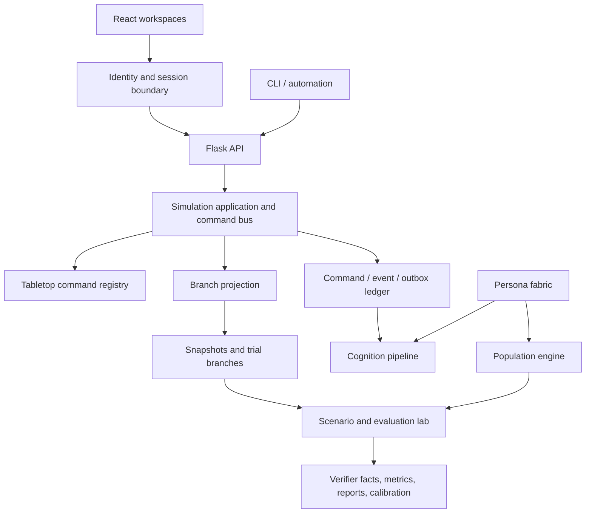

# Architecture and invariants

## System shape

The system separates human identity, simulation authority, canonical state, subjective minds,
large populations, and experimental evidence.



`world_id`, `run_id`, and `interaction_id` are kernel terms. Campaigns, sessions, and encounters
are tabletop interpretations rather than core primitives.

## Identity, roles, actors, and capabilities

Human access has two role scopes:

- `ADMIN` is a global platform role.
- `DM` and `PLAYER` are grants tied to a specific world.

Every account has an actor ID. The identity repository translates role changes into explicit
world/actor authority rows used by the simulation kernel and PostgreSQL RLS. A grant in one
world never authorizes another world.

Actors are `HUMAN`, `AGENT`, or `SYSTEM`. Their world-scoped roles, capabilities, and controlled
entities authorize operations such as:

- `world.read` and `world.read.all`;
- `entity.control` and `entity.read.secret`;
- `action.propose` and `action.commit`;
- `run.branch`;
- `mind.read.all` and `mind.write.all`;
- `metric.evaluate`;
- `canonical.promote`.

The API checks product roles; the command bus checks simulation capabilities and controlled
entities; PostgreSQL repeats protected-state checks with forced RLS.

## State, commands, and events

`BranchState` contains named projections, a monotonically increasing version, and a stable
SHA-256 state hash. Supported delta operations are `SET`, `MERGE`, `DELETE`, and `INCREMENT`.

Command definitions declare a stable name/version, typed input, typed output, required
capabilities, eligible branch kinds, and a deterministic handler. The in-memory adapter applies
deltas to a copy and publishes only after success. The PostgreSQL adapter locks the branch
projection and commits the projection, command, event, and outbox in one transaction.

`EventEnvelopeV2` carries world/branch/run/interaction lineage, actor and embodied entity,
visibility and observation scope, correlation/causation, idempotency, seed, decision trace,
persona/policy/prompt/model versions, tags, payload, and creation time.

## Canonical state, snapshots, trials, and replay

Each world has one canonical branch. A snapshot is a deterministic gzip artifact containing the
projection, command boundary, contract version, and content hashes. Trial branches load an
immutable snapshot and preserve logical entity IDs beneath a different branch-scoped key.

Trials write only their own projection and ledger. Canonical promotion is a separate reviewed
command requiring:

- a real source trial in the same world;
- `canonical.promote` and `action.commit`;
- explicit consequence deltas and a human review note;
- the expected current canonical state hash.

Replay starts at the latest valid branch snapshot and reapplies subsequent durable command
records. Each resulting hash must equal the committed hash.

## Persona fabric

The schema registry loads 80 dimensions from four YAML packs:

- `core`: cognition, personality, values, communication, social style, risk, and habits;
- `world`: species, culture, religion, class, education, occupation, and faction context;
- `tabletop`: experience, rules familiarity, play preferences, optimization, and metagaming;
- `accessibility`: reading, visual, motor, cognitive-load, and interface preferences.

Dependencies and constraints form a graph. Generation uses a declared schema version, generator
version, ruleset version, seed, fixed dimensions, and optional weighted distributions.
Provenance records the source of each field. The compiler turns deep traits into policy weights,
starting beliefs/goals/relationships, routines, capability modifiers, retrieval filters, and a
bounded prompt summary.

## Subjective cognition

Canonical truth, observation, belief, memory, relationship, and narration are separate records.
The pure subjective pipeline is:

```text
visible event -> perceived observation -> belief revision -> memory
             -> goal/need activation -> candidate actions
             -> reflex / utility / bounded plan / typed deliberation
             -> CommandProposal
```

Reflex, utility, and bounded GOAP tiers are deterministic. Model deliberation is optional,
receives an allowed action set, and must return a typed proposal; provider failure falls back to
policy. Runtime assignments cap which tier may act. Relationship changes require a visible
same-branch source event and preserve immutable causal history.

## Population engine

Population operates at three levels:

| Level | Representation | Use |
| --- | --- | --- |
| Statistical | Parquet distributions queried with DuckDB | millions of potential people and cohort analysis |
| Materialized | persistent person and compressed state | households, occupation, finances, beliefs, and scheduled background updates |
| Active | full in-scene cognition state | perception, planning, relationships, and optional model calls |

Pools are immutably bound to a world and branch. Generation streams bounded batches. Filtering,
weighted sampling, stratified sampling, and aggregates execute in DuckDB. Lifecycle transitions
preserve persistent state and monotonic world steps.

## Scenario and evaluation lab

A scenario version specifies a base snapshot, world setup, cohort, intervention, allowed actions,
horizon, stop conditions, runtime/model assignment, seeds, verifiers, and metric contracts.

The lab creates an isolated branch per trial, executes typed proposals, records the trial ledger,
normalizes verifier facts, reduces metrics, and builds a cohort report. Jobs checkpoint per trial,
support cancel/retry, and restore completed inspection history after restart. A process interrupted
while `RUNNING` restores as an explicit retryable failure rather than assuming side effects did or
did not complete.

Calibration compares a synthetic report with versioned evidence. Review approves or rejects the
proposal. Promotion registers an approved immutable version; selecting a runtime version remains
a separate operator decision.

## Storage map

| Store | Data |
| --- | --- |
| PostgreSQL | identity, roles, worlds, branches, projections, actors, entities, sessions, characters, games, minds, lifecycle state, experiment catalogs, telemetry, and ledgers |
| Redis/RQ | experiment queues, job delivery, retry coordination |
| Qdrant | semantic lore and retrieval collections |
| Parquet + DuckDB | large persona pools, cohort queries, population analysis |
| Artifact volume | snapshots, trial outputs, reports, calibration records, replay bundles |
| Static bundle | compiled React application under `static/v2` |

## Package map

```text
TableTop_DM/
├── identity/                 accounts, sessions, roles, audit
├── kernel/                   contracts, command bus, state, branches, API
├── domains/tabletop/         tabletop commands and user portal
├── persona/                  schema, generation, validation, compilation
├── cognition/                subjective state and layered decisions
├── population/               cohorts, Parquet/DuckDB, lifecycle
├── experiments/              scenarios, trials, metrics, reports, calibration
├── frontend/                 React source
├── static/v2/                production frontend bundle
├── infra/                    migrations and Compose
├── scripts/                  lifecycle, tests, readiness, wheel verification
└── tests/                    unit, contract, integration, browser suites
```

The broader workspace concept used to guide the role-specific surfaces is available as the
[multi-surface interface concept](../frontend/design/simulation-kernel-multi-surface-concept.png).

## Non-negotiable invariants

1. Models never own world truth.
2. Human identity, simulation actor, persona, body, mind, and runtime remain distinct.
3. Canonical truth, observation, belief, memory, relationship, and narration remain distinct.
4. Persona profiles and scenario definitions are versioned and reproducible.
5. Every stochastic decision records its seed.
6. Every model decision records model, prompt contract, policy, runtime, and trace provenance.
7. Canonical mutations pass through typed validation and authorization.
8. Experiment branches cannot mutate canonical state.
9. Verifiers emit normalized facts with evidence.
10. Synthetic results are hypotheses, not human ground truth.
11. World-scoped roles and capabilities never leak across worlds.
12. Secrets, credentials, private notes, and secret entity state never enter public projections or
    client-visible logs.
