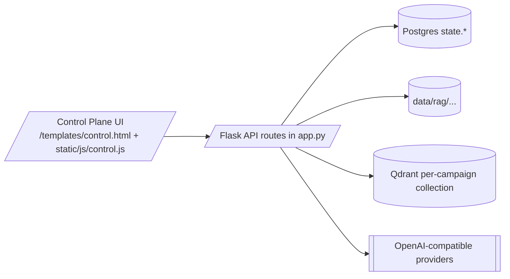
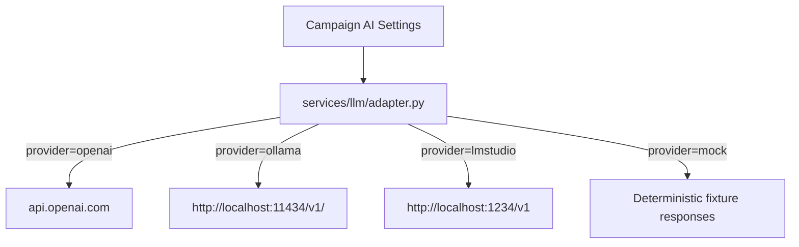

# Control Plane Architecture

```mermaid
flowchart LR
  UI[/Control Plane UI\n/templates/control.html + static/js/control.js/] --> API[/Flask API routes in app.py/]
  API --> DB[(Postgres state.*)]
  API --> FS[(data/rag/...)]
  API --> VDB[(Qdrant per-campaign collection)]
  API --> LLM[[OpenAI-compatible providers]]
```

```mermaid
flowchart TD
  CP[Campaign AI Settings] --> ADAPTER[services/llm/adapter.py]
  ADAPTER -->|provider=openai| OPENAI[api.openai.com]
  ADAPTER -->|provider=ollama| OLLAMA[http://localhost:11434/v1/]
  ADAPTER -->|provider=lmstudio| LMSTUDIO[http://localhost:1234/v1]
  ADAPTER -->|provider=mock| MOCK[Deterministic fixture responses]
```
