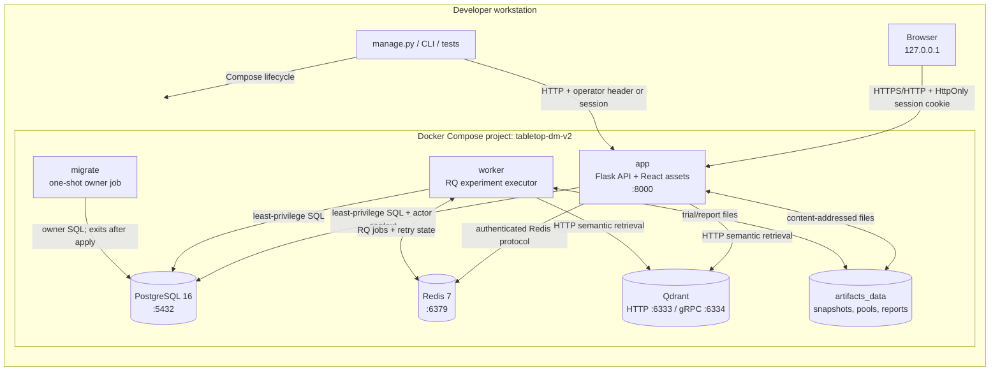
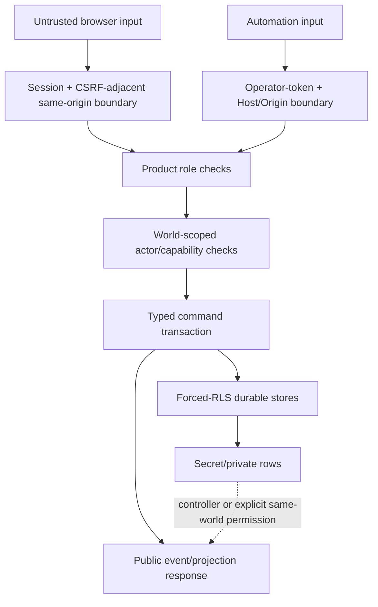
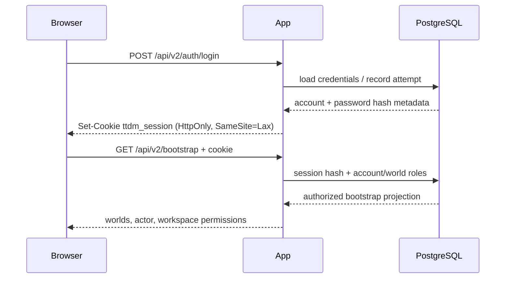
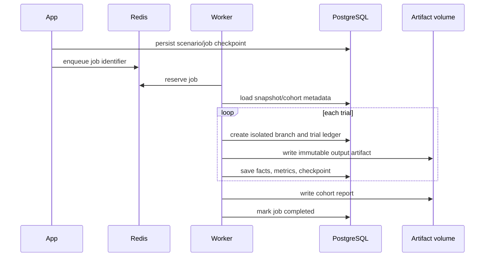
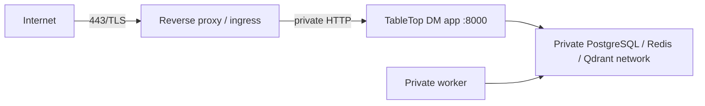

# Network and deployment

This document describes the default managed topology, trust boundaries, ports, and primary data
flows. The default deployment is intentionally local-only.

## Default network diagram



All published ports bind to `127.0.0.1` unless the operator explicitly changes a bind-address
variable. Containers communicate on the private Compose network through service DNS names.

## Port and exposure table

| Service | Container port | Default host binding | Authentication | Normal caller |
| --- | ---: | --- | --- | --- |
| App | 8000 | `127.0.0.1:8000` | HTTP-only user session or operator token | browser, CLI, Playwright |
| PostgreSQL | 5432 | `127.0.0.1:5432` | generated owner/runtime passwords | migrate, app, worker, integration tests |
| Redis | 6379 | `127.0.0.1:6379` | generated password | app, worker |
| Qdrant HTTP | 6333 | `127.0.0.1:6333` | network boundary in local profile | app, worker, readiness |
| Qdrant gRPC | 6334 | `127.0.0.1:6334` | network boundary in local profile | optional local clients |

The application is the only endpoint intended for human interaction. Direct database, Redis, and
Qdrant ports are published for local diagnostics and integration tests, not for remote clients.

## Trust boundaries



The boundaries serve different purposes:

1. **Session boundary** identifies a human account.
2. **Product-role boundary** controls Admin, DM, and Player workflows.
3. **Actor/capability boundary** controls a simulation mutation inside one world.
4. **Typed-command boundary** validates domain input and branch eligibility.
5. **RLS boundary** limits durable rows even if application code is wrong.
6. **Visibility boundary** prevents secret state, DM notes, and unobserved events from entering
   public responses.

## Request flows

### Human login



Password hashing uses `scrypt`; raw passwords and session tokens are never stored. The cookie is
marked `Secure` when the request is HTTPS.

### Canonical command

```mermaid
sequenceDiagram
    participant U as Browser/runtime
    participant A as App
    participant K as Command repository
    participant P as PostgreSQL
    U->>A: typed proposal + IDs + idempotency key
    A->>K: authenticated account/actor context
    K->>P: BEGIN; set_config(app.actor_id); lock branch
    K->>K: validate schema, lineage, capability, control
    K->>K: deterministic handler + deltas
    K->>P: projection + command + event + outbox
    P-->>K: COMMIT
    K-->>A: receipt + state/event hashes
    A-->>U: canonical result
```

No model or client receives a direct database mutation path.

### Scenario job



Redis transports work; it is not the evidence store. A restart reconstructs inspection history
from PostgreSQL and immutable artifacts.

## Volumes and data paths

```text
postgres_data  -> PostgreSQL cluster
redis_data     -> queue persistence
qdrant_data    -> vector collections
artifacts_data -> snapshots, Parquet pools, trials, reports, calibration evidence
```

Back up `postgres_data` and `artifacts_data` together. A consistent recovery may also require
source lore for Qdrant reconstruction. Redis is operational coordination and can usually be
rebuilt from durable job records.

## Remote deployment requirements

The repository does not claim that changing `APP_BIND_ADDRESS` to `0.0.0.0` creates a secure
internet deployment. A remote deployment needs, at minimum:

- a reverse proxy or ingress terminating TLS;
- secure cookies and a reviewed trusted-proxy configuration;
- firewall rules that keep PostgreSQL, Redis, and Qdrant private;
- Qdrant authentication or an isolated service network;
- unique external secrets from a secret manager;
- a strict `CORS_ALLOWED_ORIGINS` policy;
- Host/Origin handling appropriate to the public domain;
- rate limiting and centralized security logging;
- database and artifact backups with restore tests;
- an explicit telemetry and data-retention policy.

Only the reverse proxy should be publicly reachable:



## Readiness and failure behavior

- App liveness does not imply dependencies are safe for traffic.
- The migration job must complete before app or worker starts.
- `/readyz` fails with details when PostgreSQL, migration state, Redis, or Qdrant is unavailable.
- An interrupted experiment is restored as retryable failure, not silently replayed.
- A failed command transaction writes no projection, ledger, or outbox partial.
- Missing actor context fails closed under RLS.

See [Operations](OPERATIONS.md) for lifecycle commands, backups, credentials, and migrations.
